# 🌌 Ujjwal Singh: The Reality Architect 🌌

> *"I don't just write code—I bend reality. Where others see limitations, I see possibilities waiting to be coded into existence."*

<div align="center">

### ⚡ **Reality Bender** | **Code Alchemist** | **Digital Dreamweaver**


</div>

---

## 🎭 **The Illusion of Limitations**

<div align="center">

> *"Reality is merely an illusion, albeit a very persistent one." - Albert Einstein*

```python
class RealityArchitect:
    def __init__(self):
        self.belief = "No limits exist except those we accept"
        self.tools = "Code, Creativity, Conviction"
    
    def bend_reality(self, dream):
        """Transform impossible dreams into working code"""
        if self.see_possibility(dream):
            blueprint = self.architect_reality(dream)
            return self.build_with_passion(blueprint)
        return self.create_new_possibility(dream)
```

</div>

---

## 🛠️ **Reality-Bending Arsenal**

<div align="center">

### **Foundation Stones**


### **Dimensional Tools**


</div>

---

## 📊 **Reality Metrics**

<div align="center">


</div>

---

## 🌠 **Current Reality Projects**

### **Project: Dreamweaver Engine** 🧠
> *"Turning abstract thoughts into functional code"*
```javascript
class Dreamweaver {
  constructor() {
    this.imagination = 'limitless';
    this.execution = 'flawless';
  }
  
  manifestDream(dream) {
    return new Reality(dream.blueprint(), this.passion);
  }
}
```

### **Project: Dimension Bridge** 🌉
> *"Connecting different technological realms seamlessly"*
```python
def create_bridge(from_realm, to_realm):
    """Build bridges between different tech stacks"""
    understanding = learn_essence(from_realm)
    innovation = adapt_essence(understanding, to_realm)
    return Bridge(innovation, scalable=True)
```

### **Project: Reality Simulator** 🎮
> *"Testing ideas in simulated environments before real implementation"*
```java
public class RealitySimulator {
    public Reality testConcepts(List<Idea> ideas) {
        return ideas.stream()
                   .map(this::simulateReality)
                   .filter(Reality::isViable)
                   .findFirst()
                   .orElse(createNewReality());
    }
}
```

---

## 🏗️ **Architecture of Possibility**

<div align="center">

| **Realm** | **Status** | **Progress** | **Next Evolution** |
|-----------|------------|--------------|-------------------|
| **Frontend Dimensions** 🎨 | Building | ██████████░░ 85% | Interactive Web Worlds |
| **Backend Foundations** ⚙️ | Strengthening | ████████░░░░ 75% | RESTful API Mastery |
| **Mobile Realities** 📱 | Exploring | █████░░░░░░░ 50% | Cross-Platform Development |
| **Cloud Ecosystems** ☁️ | Learning | ████░░░░░░░░ 40% | Deployment Strategies |

</div>

---

## 🌊 **The Flow of Creation**

```mermaid
graph TB
    A[💡 Idea] --> B[🔄 Transformation]
    B --> C[⚡ Energy]
    C --> D[🏗️ Structure]
    D --> E[🌍 Reality]
    E --> F[🚀 Evolution]
    F --> A
    
    style A fill:#00CED1
    style B fill:#20B2AA
    style C fill:#40E0D0
    style D fill:#48D1CC
    style E fill:#00FFFF
    style F fill:#AFEEEE
```

<div align="center">



</div>

---

## ⚡ **The Student's Manifesto**

```javascript
// The Code of Infinite Potential
const studentMindset = {
  currentState: "Empty cup", // Ready to learn
  belief: "Every expert was once a beginner",
  method: "Consistent daily practice",
  goal: "Mastery through iteration",
  
  transformReality() {
    while (true) {
      this.learn();
      this.build();
      this.fail();
      this.learnFromFailure();
      this.improve();
    }
  }
};
```

---

## 🌈 **Dimensions of Growth**

<div align="center">

### **The Four Pillars of Mastery**

| **Pillar** | **Focus** | **Current Mission** |
|------------|-----------|---------------------|
| **🧠 Knowledge** | Learning Fundamentals | Master Data Structures & Algorithms |
| **⚡ Execution** | Building Projects | Create 10 meaningful projects |
| **🔍 Analysis** | Understanding Systems | Reverse engineer great software |
| **🚀 Innovation** | Creating New Value | Solve real-world problems |

</div>

---

## 📚 **Reality Library**

<div align="center">

### **Currently Absorbing**
- **Quantum Code**: Advanced algorithms and patterns
- **Architecture Grimoire**: System design principles  
- **UI/UX Alchemy**: Human-computer interaction magic
- **Database Mysteries**: Data storage and retrieval arts

### **Next Spells to Learn**
```bash
# Command Line Incantations
~$ learn --topic "cloud infrastructure"
~$ master --skill "machine learning"
~$ explore --field "blockchain technology"
```

</div>

---

## 🤝 **Collaboration Portals**

<div align="center">

[](https://linkedin.com/in/ujjwal-singh)
[](mailto:ujjosing@gmail.com)
[](https://github.com/fallofpheonix)
[](https://your-portfolio.com)

</div>

---

## 🎯 **Current Reality Missions**

<div align="center">

### **Active Quests**
- [ ] **Build a full-stack application that helps students learn**
- [ ] **Master one new programming concept every week**
- [ ] **Contribute to open-source projects monthly**
- [ ] **Create a personal project that solves a real problem**
- [ ] **Network with experienced developers regularly**

### **Quest Progress**
```
2024 Goals: ██████████░░░░░░ 65% complete
Learning:   ████████░░░░░░░░ 70% complete
Projects:   █████░░░░░░░░░░░ 45% complete
Networking: ████░░░░░░░░░░░░ 35% complete
```

</div>

---

## 🌟 **Daily Reality Rituals**

```python
class DailyGrind:
    def morning_ritual(self):
        self.meditate_on_code()
        self.plan_todays_reality_shifts()
        self.learn_something_new()
    
    def creation_session(self):
        while motivation > 0:
            self.code_with_purpose()
            self.test_reality_edges()
            self.push_boundaries()
    
    def evening_reflection(self):
        self.review_progress()
        self.celebrate_wins()
        self.plan_tomorrows_evolution()
```

---

## 📊 **Reality Expansion Map**

<div align="center">


*Each connection represents a day I chose growth over comfort*

</div>

---

## 💫 **The Philosophy**

<div align="center">

> *"I'm not just learning to code—I'm learning to create. Every bug fixed is a limitation overcome. Every feature built is a new possibility manifested."*


**The only limit is the one you accept.** 🚀

</div>

---

*This reality is under active construction. Expect daily updates and dimensional expansions.* 🌌

<div align="center">

**⚡ Today's Reality Shift: Building a student productivity platform while mastering React patterns**

</div>

## 🚀 **Quick Start Guide to My Reality**

```bash
# Clone my mindset
git clone https://github.com/fallofpheonix/determination.git

# Install passion
npm install relentless-curiosity

# Run daily growth
node daily-evolution.js --intensity=max --consistency=true
```

---

## 🌙 **Nocturnal Coding Sessions**

```javascript
// When the world sleeps, I code
const nocturnalCreator = {
  hours: "10PM - 2AM",
  environment: "Quiet + Coffee",
  focus: "Deep work sessions",
  output: "Magic happens here",
  
  createAfterDark() {
    while (moonIsUp) {
      this.build();
      this.learn();
      this.innovate();
    }
  }
};
```

---

**✨ Remember: You're not just coding—you're architecting reality itself. Make it magnificent.**

---

<div align="center">

### **Join Me in Shaping Digital Realities**

[](https://github.com/fallofpheonix)
[](https://github.com/fallofpheonix?tab=repositories)

</div>

---

*"The computer programmer is a creator of universes for which he alone is the lawgiver. No playwright, no stage director, no emperor, however powerful, has ever exercised such absolute authority to arrange a stage or field of battle and to command such unswervingly dutiful actors or troops." - Joseph Weizenbaum*

**Let's build universes together.** 🌌

---

### 🎯 **Immediate Focus Areas**
- **Frontend Mastery**: React, TypeScript, Modern CSS
- **Backend Fundamentals**: Node.js, Express, Databases
- **Problem Solving**: LeetCode, Algorithm Challenges
- **Project Building**: Real-world applications

### 📈 **Growth Trajectory**
```
Current Level: Junior Reality Architect
Next Level: Mid-Level Dimension Builder
Target: Senior Universe Engineer
```

**The journey of a thousand codebases begins with a single commit.** 💫

---

*Last updated: ${new Date().toLocaleDateString()} - Reality version 2.0*
